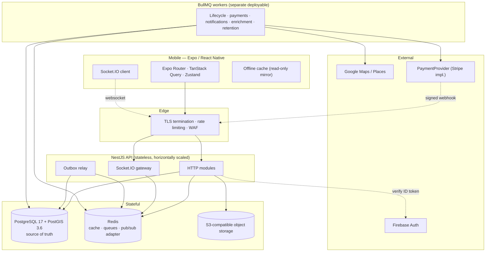
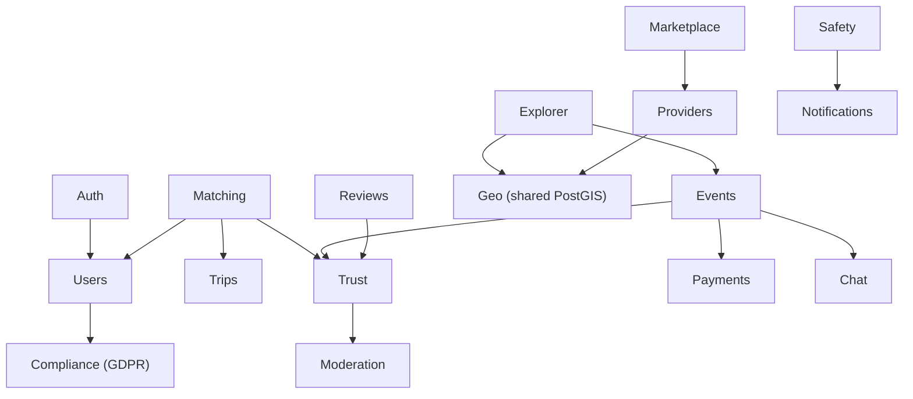

# TripWith — Phase 1: Architecture and Database

**Date:** 2026-08-20
**Status:** Implemented and verified against PostgreSQL 17.11 / PostGIS 3.6.4
**Scope:** Architecture, complete relational model, initial migration. No controllers, no frontend, no payment-provider implementation.

---

## 1. Decisions taken before design

Four choices were confirmed rather than assumed, because each one changes the shape of the artifacts in this phase.

| Decision | Choice | Consequence for Phase 1 |
|---|---|---|
| Data layer | TypeORM + hand-written SQL migrations | Migrations are reviewable `.sql`; no generator mangles GIST/partial/generated constructs |
| Regulatory baseline | EU-first (GDPR + PSD2/SCA, EUR) | `user_consents` ledger exists now; payments model an SCA challenge state; money is integer minor units + ISO-4217 |
| Minimum age | 18+ platform-wide | Enforced by trigger; age-preference columns carry a hard floor of 18 |
| Repo layout | pnpm + Turborepo monorepo | `packages/shared` owns enums consumed by API and mobile, satisfying §32 |

### Assumptions that materially affect architecture

Flagged explicitly per §34, because each is a business decision this document should not make silently.

1. **The €15 deposit is a platform fee retained by TripWith, not funds held on behalf of the provider.** The schema uses `authorization` / `deposit` / `capture` and never the word escrow. If the business model is actually custodial, the payments design changes materially (segregated balances, payout ledger, likely a licensing requirement) and must be revisited before Phase 10.
2. **Remaining provider payment happens off-platform.** No payout, invoice, or settlement tables exist. Adding them later is additive.
3. **Google Places content caching windows** are set by configuration, not hard-coded, because the permitted window is a policy value that must be confirmed against the current Places terms at implementation time. The schema stores a per-row `cache_expires_at` so a policy change is a config change, not a migration.
4. **Identity verification (`user_profiles.identity_verified_at`) is a placeholder for a provider not yet chosen.** Trust weighting for verified accounts is deferred to Phase 8.

---

## 2. High-level system architecture



**Load-bearing properties.**

The API is stateless: any instance can serve any request, and Socket.IO rooms are shared through the Redis adapter rather than instance memory. Workers are a *separate deployable* from the API — a burst of image enrichment must never contend for the request path's CPU. PostgreSQL is the sole source of truth; Redis holds only data that can be lost without incorrectness (caches, queues, presence, socket routing).

---

## 3. Backend module architecture

Each domain owns its tables and exposes a service interface. Cross-domain reads go through the owning service, never by reaching into another module's repository.



Platform modules underneath all of the above: `Config`, `Database`, `Geo`, `Queue` (BullMQ), `Realtime` (Socket.IO), `Observability`.

Two modules are additions to the §4.1 list, both justified:

- **`GeoModule`** — shared PostGIS query builders. Explorer, Matching and Marketplace all need radius/viewport predicates; without a shared home that SQL gets copy-pasted three times and drifts.
- **`ComplianceModule`** — GDPR consent capture, data-subject export/erasure, retention sweeps. The EU-first decision pulls this into Phase 1 rather than leaving it to hardening.

Business logic lives in services. Controllers validate and delegate; repositories own SQL.

---

## 4. Core data flows

### 4.1 Paid event join — the transaction-heavy path

```mermaid
sequenceDiagram
    participant U as Traveller
    participant API
    participant PG as PostgreSQL
    participant PP as PaymentProvider
    participant Q as BullMQ

    U->>API: POST /events/:id/join-requests
    API->>PG: check trust gate, blocks, capacity, existing request
    API->>PP: authorize(amount, idempotencyKey)
    PP-->>API: authorization + expiry (persisted, not assumed)
    API->>PG: BEGIN
    API->>PG: INSERT payments (AUTHORIZED)
    API->>PG: INSERT event_join_requests (PENDING, expires_at)
    API->>PG: INSERT job_outbox ('joinRequest.expire')
    API->>PG: COMMIT
    Q-->>API: relay publishes outbox row after commit
    Note over API,PP: Host approves
    API->>PG: BEGIN; SELECT event FOR UPDATE
    API->>PG: UPDATE join_request -> APPROVED
    API->>PG: INSERT event_participants (trigger increments count, CHECK guards capacity)
    API->>PG: INSERT job_outbox ('payment.capture')
    API->>PG: COMMIT
```

The **transactional outbox** exists because enqueuing to BullMQ is a Redis network call that cannot join a PostgreSQL transaction. Writing the job intent to `job_outbox` inside the same transaction means "approve the request" and "schedule the capture" commit or roll back together. Without it, a crash between `COMMIT` and `enqueue` silently loses the job — and the lost job here is a payment capture.

### 4.2 Mutual match creation

Swipe writes to `swipes`. If a reciprocal `LIKE` exists, one transaction creates the `chat_rooms` row, both `chat_members` rows, and the `matches` row with canonically ordered user IDs. The `CHECK (user_a_id < user_b_id)` plus `UNIQUE (user_a_id, user_b_id)` make a duplicate impossible even if both users swipe in the same millisecond — the loser gets a unique violation and reads the winner's row.

---

## 5. External service boundaries

| Service | Boundary | Rule |
|---|---|---|
| Firebase Auth | `AuthModule` verifies the ID token server-side on every request | A client-supplied user ID is never trusted. The authenticated UID maps to `users.firebase_uid`; everything downstream uses the internal UUID |
| Google Places | `ProvidersModule` via an enrichment worker | Results land in `provider_external_sources`, never in `providers` columns. Composed at read time |
| PaymentProvider | Interface: `authorize / capture / cancelAuthorization / refund / getPaymentStatus / handleWebhook` | Domain code sees TripWith's `payment_status`, never a Stripe object. Provider status is stored verbatim alongside, for reconciliation only |
| S3 | Pre-signed upload URLs | The API never proxies file bytes |

---

## 6. Redis and BullMQ responsibilities

**Redis holds only what can be lost without corrupting state:** matching feed pages, Explorer viewport results, provider profile summaries, rate-limit counters, Socket.IO pub/sub, presence. Nothing authorization-related is cached — an account restriction or block must take effect on the next request, so those are always read from PostgreSQL.

**Queues:**

| Queue | Trigger | Idempotency key |
|---|---|---|
| `joinRequest.expire` | delayed to `expires_at` | join request id + status |
| `payment.capture` / `payment.cancel` | outbox after approval/rejection | `payments.idempotency_key` |
| `event.lifecycle` | scheduled scan of `events_lifecycle_idx` | event id + target status |
| `review.window.close` | 48h after completion | event id |
| `provider.refresh` | scan of `provider_external_sources_expiry_idx` | source + external id |
| `sos.retention` | periodic | session id |
| `outbox.relay` | continuous | outbox row id |

No delayed business operation uses `setTimeout` or a long-running request.

---

## 7. Real-time architecture

Socket.IO with the Redis adapter. Rooms are `user:{id}` (personal events) and `chat:{roomId}` (conversation traffic). Connections authenticate with the same Firebase token check as HTTP; membership in a `chat:` room is authorised against `chat_members` on join, not assumed from the room name.

**The database is the source of truth, always.** A message is persisted first, then broadcast. A dropped socket costs a redelivery, never a lost message — the client reconciles on reconnect by requesting everything after its last known `seq`. This is why `messages.seq` is gapless and monotonic per room: it makes "what did I miss?" an exact query rather than a timestamp heuristic.

---

## 8. Security and privacy boundaries

- **Authorization is server-side without exception.** UI affordances are not a security control.
- **Ownership is verified on every mutation** — hosts on their events, owners on their providers, members on their rooms.
- **Webhooks verify signatures before any state change**, and record `signature_verified` on the stored event.
- **Secrets come from the environment.** `data-source.ts` throws on a missing variable rather than defaulting.
- **SOS tokens are stored as SHA-256 digests**, never plaintext: a database leak must not yield working share URLs.

### The live-location invariant

This is the privacy property most worth making structural rather than procedural:

> Live GPS coordinates exist in exactly one table — `sos_location_updates` — and no discovery query references it.

Three mechanisms enforce it, and all three are asserted by the test suite:

1. `users`, `user_profiles` and `user_settings` have **no geography column at all**. There is nowhere to write a live fix on a person.
2. `sos_location_updates` has **no spatial index**, so a proximity query over it cannot be efficient — accidental use is loud, not silent.
3. The total count of geography columns in the schema is asserted to be exactly six, listed by name. Adding a seventh fails the suite and forces a deliberate review.

Location sensitivity tiers: public event meeting points are discoverable; trip destinations are profile-visibility-controlled and are *area centroids, never device fixes*; live location is SOS-only, token-gated, time-boxed, revocable and access-logged.

---

## 9. Matching engine

`M = 0.40·I + 0.30·T + 0.20·S + 0.10·P`, every component normalised to `[0,1]`, so `0 ≤ M ≤ 1`.

- **`T` — trust quality**, `trust_score / 10`. Quality, not similarity: two users at 2.0 are not compatible merely because they match. A small similarity term may be added later at low weight.
- **`S` — travel style**, `1 − |a − b| / 4` over the 1–5 scale.
- **`P` — interests**, Jaccard `|A∩B| / |A∪B|` over normalised interest IDs, computed with `intarray` on the denormalised `interest_ids` array.
- **`I` — itinerary compatibility**, combining shared destinations, date overlap and geographic proximity. Date overlap uses `max(0, min(Aend,Bend) − max(Astart,Bstart))`, normalised against the shorter of the two stays.

### Candidate generation without a silent recall cliff

A plain `LIMIT N` before scoring can discard the true best candidate. The pipeline avoids that:

**Stage 0 — hard elimination.** Pure indexed predicates, no scoring: inactive/deleted accounts, self, already-swiped (anti-join), blocked in either direction, Ghost Mode, mutual age-preference violation, trust floor, active matching restrictions.

**Stage 1 — spatio-temporal anchor.** A candidate must have at least one `trip_segment` within radius *R* of one of the viewer's segments **and** overlapping it in time. This is not an arbitrary cap; it is §7's own eligibility rule, and it is served by the composite GIST index in a single scan.

**Stage 2 — deterministic coarse pre-rank by an admissible upper bound.** In SQL, compute

```
M_ub = 0.40·I_ub + 0.30·T + 0.20·S + 0.10·P
```

where `T`, `S` and `P` are **exact** (all three are cheap column/array operations) and `I_ub` is an **over-estimate** of `I` taken from the single best segment pair. Because true `I` aggregates across segment pairs with a normalisation that cannot exceed the best pair's value, `I_ub ≥ I`, and therefore **`M_ub ≥ M` for every candidate**.

Order by `M_ub DESC, user_id ASC` — the tie-break makes the ordering total and stable, so cursor pagination cannot skip or repeat a candidate. Take `N`.

**Stage 3 — exact scoring** of those `N` in TypeScript, where the four scoring functions are pure and unit-testable.

**Why `N` is not silently lossy.** Fetch `N+1` rows and compute

```
slack = min(M over the N scored) − M_ub of row N+1
```

Since every unexamined candidate has `M ≤ M_ub ≤ M_ub(row N+1)`, `slack ≥ 0` **proves** no discarded candidate could have entered the returned set. When `slack < 0`, exactness is merely unproven for that request — the service emits a `matching.recall_unproven` counter. The failure mode is observable rather than invisible.

**The recall/performance trade-off.** `N` trades scoring cost (linear in `N`) against the proven-exactness rate. It is a tuning parameter, not a constant: starting value **500**, calibrated in Phase 4 against the harness above by sweeping `N` and recording p50/p95 latency alongside the `recall_unproven` rate. The target is a rate near zero at acceptable latency; a persistently non-zero rate means `N` is too small for the population density and must be raised, or `I_ub` tightened.

### Feed caching

Cross-user invalidation is deliberately **not** attempted — one user editing a trip would fan out to every viewer who could possibly see them, which is unbounded. Instead:

- Key: `feed:v{gen}:{viewerId}:{filterHash}`, where `gen` is a per-viewer counter in Redis.
- **TTL 90 seconds.** This is the entire staleness contract: another traveller's change may take up to 90s to surface.
- **Viewer-side invalidation is immediate**, by `INCR feed:gen:{viewerId}` — an O(1) operation that orphans every cached page for that viewer without a `SCAN`. Triggered by: swipe, block/unblock, filter change, Ghost Mode toggle, trip create/update/delete, and profile changes affecting interests or travel style.

---

## 10. Database model

35 application tables. Full DDL: [`1787184000000-InitialSchema.up.sql`](../../../apps/api/src/database/migrations/sql/1787184000000-InitialSchema.up.sql).

Conventions: UUID primary keys (`BIGINT` identity only for append-only high-volume logs), `timestamptz` throughout, money as integer minor units + ISO-4217, `GEOGRAPHY(POINT,4326)` for anything measured in metres, soft deletion only where a dependent record must survive.

### Identity

**`users`** — the account. `firebase_uid` (unique) is the only link to the auth provider and is written only from a server-verified token. `trust_score_raw` is the *unclamped* running total; `trust_score` is a generated `STORED` column clamping it to `[0,10]`. Soft-deleted, because messages, reviews, payments and the trust ledger all reference it; GDPR erasure anonymises rather than deletes, since financial records carry a statutory retention obligation that overrides the erasure right.
*Constraints:* email format, E.164 phone, DOB sanity, `UNIQUE (id, date_of_birth)` as an FK target.
*Indexes:* unique `firebase_uid`, unique `lower(email)`, partial `(trust_score) WHERE ACTIVE AND NOT deleted`.
*Trigger:* `tw_enforce_minimum_age` — 18+ cannot be a CHECK, see §12.

**`user_profiles`** — display data and matching inputs. `travel_style` 1–5, `interest_ids INT[]` as a trigger-maintained projection of `user_interests` with a `gin__int_ops` index. **No geography column, by design.**

**`user_settings`** — Ghost Mode, discovery preferences, age/trust/distance filters. Age preferences carry `CHECK (min_age_preference >= 18)`, so a preference can never widen the audience below the platform floor.

**`user_consents`** — append-only GDPR ledger. Withdrawal is a new row, never an UPDATE, because proving *when* consent existed is the point.

### Interests

**`interests`** (lookup) and **`user_interests`** (join, PK `(user_id, interest_id)`). Source of truth for the array projection above.

### Trips (§6 — normalised, not JSONB)

**`trips`** — owner, title, dates, visibility. `metadata JSONB` holds only non-searchable extras. `UNIQUE (id, user_id)` exists purely as the FK target below.

**`trip_segments`** — the searchable unit. `location` is a destination centroid, never a device fix. `date_range` is `GENERATED ALWAYS AS (daterange(start_date, end_date, '[]')) STORED`.
*The composite FK* `(trip_id, user_id) REFERENCES trips(id, user_id)` guarantees the denormalised `user_id` matches its trip — enforced by the database, not by a trigger or by application discipline.
*Index:* one composite `GIST (location, date_range)` — see §12 for the measurements behind that choice.

### Providers

**`providers`** — TripWith-owned data only. `CHECK (published_at IS NULL OR confirmed_by_owner_at IS NOT NULL)` makes §11's "never silently publish imported data" structurally impossible to violate. Partial GIST on `location` restricted to published+active+undeleted rows.

**`provider_external_sources`** — the provenance boundary. Holds `external_id` (the Place ID, an opaque long-lived identifier) plus a **fixed allowlist of typed columns**, each under a TTL. It is deliberately not a raw payload dump: adding a cached field is a policy decision, and making it a schema change forces that decision into review. Ratings, review text and photos have **no column at all** and are fetched live. `CHECK` requires `cache_expires_at` whenever `cached_at` is set — cached content cannot exist without an expiry.

**`provider_media`** — first-party uploads only, keyed by S3 storage key.
**`provider_category_types`** (lookup) + **`provider_categories`** (M:N join, with a partial unique index enforcing at most one primary category). Events carry exactly one category, hence a direct FK to **`event_categories`** rather than a join table — the asymmetry is intentional.
**`provider_subscriptions`** — partial unique index allows only one live subscription per provider.

### Events

**`events`** — host is exclusively a user *or* a provider, enforced by CHECK. `participant_count` is trigger-maintained with `CHECK (participant_count <= capacity_max)` as the backstop. `time_range` is a generated `tstzrange`. Status/timestamp consistency is paired (`status = 'CANCELLED'` iff `cancelled_at IS NOT NULL`).
*Index:* partial composite `GIST (meeting_point, time_range) WHERE visibility='PUBLIC' AND status IN ('ACTIVE','FULL')` — Explorer's primary path.

**`event_status_history`** — append-only audit, written by trigger, so an untracked transition is impossible.
**`event_join_requests`** — partial unique index on `(event_id, user_id) WHERE status IN ('PENDING','APPROVED')` permits exactly one live request while preserving rejected/expired rows for audit and allowing a later re-request.
**`event_participants`** — `UNIQUE (event_id, user_id)`; drives the capacity trigger.

### Social

**`swipes`** — `UNIQUE (source, target)`, `CHECK (source <> target)`. Two indexes: one for the anti-join, one partial on incoming likes for the reciprocity probe.
**`matches`** — canonical ordering + unique pair (§13.1).
**`chat_rooms` / `chat_members` / `messages`** — membership is rows, never JSON. `chat_rooms.last_seq` and `chat_members.last_read_seq` make unread an O(1) subtraction. `messages.seq` is assigned by trigger under the room's row lock, giving a gapless per-room total order; `UNIQUE (room_id, seq)` and a `(room_id, seq DESC)` index give exact keyset pagination. `client_message_id` makes send-retry safe on flaky mobile links.

### Trust, reviews, moderation

**`reviews`** — self-review blocked by CHECK; one review per `(reviewer, event, reviewee)` via partial unique indexes (the tuple contains NULLs, so a plain UNIQUE would not bite). `is_verified` requires an event context.
**`trust_score_events`** — append-only ledger, unique `idempotency_key`, `CHECK (source_user_id <> user_id)`. An `AFTER INSERT` trigger is the **only** writer of `users.trust_score_raw`. Reversal inserts a compensating row referencing the original; nothing is edited or removed. A pair index supports detecting reciprocal boosting rings.
**`account_restrictions`** — explicit and time-bounded, with `notified_at` and an index over un-notified rows, because §16 forbids silent shadow-banning.
**`user_blocks`** — directional record, symmetric effect; indexed both ways so candidate generation can exclude both directions.
**`reports`** — polymorphic target with an exhaustive CHECK ensuring exactly one target column is set for the declared type.

### Safety

**`sos_sessions`** — SHA-256 token digest (`CHECK octet_length = 32`), expiry, revocation, one active session per user.
**`sos_location_updates`** — the only live-fix table. `BIGINT` identity, no spatial index, swept by a retention job.
**`sos_access_log`** — §24's access logging, including denied attempts.

### Platform

**`job_outbox`** — transactional job intent (§4.1).

---

## 11. ER overview

```mermaid
erDiagram
    users ||--|| user_profiles : has
    users ||--|| user_settings : has
    users ||--o{ user_consents : records
    users ||--o{ user_interests : selects
    interests ||--o{ user_interests : chosen_by
    users ||--o{ trips : plans
    trips ||--o{ trip_segments : contains
    users ||--o{ swipes : casts
    users ||--o{ matches : participates
    matches ||--|| chat_rooms : opens
    chat_rooms ||--o{ chat_members : includes
    chat_rooms ||--o{ messages : holds
    users ||--o{ chat_members : joins
    users ||--o{ providers : owns
    providers ||--o{ provider_external_sources : sourced_from
    providers ||--o{ provider_media : shows
    providers ||--o{ provider_categories : tagged
    provider_category_types ||--o{ provider_categories : labels
    providers ||--o{ provider_subscriptions : billed_by
    users ||--o{ events : hosts
    providers ||--o{ events : hosts
    event_categories ||--o{ events : classifies
    events ||--o{ event_status_history : audited_by
    events ||--o{ event_join_requests : receives
    events ||--o{ event_participants : confirms
    users ||--o{ event_join_requests : submits
    event_join_requests ||--o| event_participants : becomes
    users ||--o{ payments : makes
    events ||--o{ payments : funded_by
    payments ||--o{ payment_events : audited_by
    users ||--o{ reviews : writes
    events ||--o{ reviews : context_for
    users ||--o{ trust_score_events : subject_of
    reviews ||--o| trust_score_events : justifies
    users ||--o{ account_restrictions : restricted_by
    users ||--o{ user_blocks : blocks
    users ||--o{ reports : files
    users ||--o{ sos_sessions : opens
    sos_sessions ||--o{ sos_location_updates : streams
    sos_sessions ||--o{ sos_access_log : accessed_via
```



---

## 12. Index strategy, with measurements

The proposed design assumed a composite `GIST (location, date_range)` would beat separate indexes. That was an assumption, so it was measured on 150,000 trip segments and 100,000 events distributed across 40 real travel hubs — clustered, not uniform, because uniform data flatters any spatial index.

**Matching predicate** (`ST_DWithin` + `date_range &&`), median over 9 runs, PostgreSQL 17.11:

| Config | Time | Buffers |
|---|---|---|
| Composite `GIST(location, date_range)` | **0.276 ms** | **326** |
| Separate `GIST(location)` + `GIST(date_range)` | 0.995 ms | 426 |
| `GIST(location)` only | 0.898 ms | 2203 |

Sensitivity sweep across radius 10/50/200 km × window 7/30/90 days — the composite wins **every** cell, by **1.24× to 5.48×**, with the advantage widening as the result set grows. This is a robust result, not a single-point artifact.

**Explorer predicate** on events: partial composite **0.073 ms / 40 buffers** vs partial spatial-only 0.230 ms / 731 buffers — 3.2× faster on 18× less buffer traffic.

**Two indexes were then measured and deliberately dropped:**

- `GIST(location)` standalone on `trip_segments`. The composite serves a bare spatial query *at least as well* (1.318 ms vs 1.597 ms), so a second 10 MB index and its write amplification buy nothing.
- `GIST(meeting_point)` standalone on `events`. Faster by 0.09 ms only in the rare no-time-filter case, at 5.5 MB plus write churn on a table whose status changes throughout the lifecycle.

**One accepted gap, recorded rather than hidden:** a *date-only* predicate on `trip_segments` cannot use the composite's leading column and degrades to **7.295 ms vs 1.508 ms** with a standalone `GIST(date_range)`. No Phase 1 access path filters segments by date without a geographic anchor, so that 8.5 MB index is not created. The measurement is written into the migration comment so re-adding it later is a decision with a known payoff rather than a guess.

Other notable choices: partial indexes carry the discovery predicates (`WHERE visibility='PUBLIC' AND status IN (...)`) so the hot GIST trees stay a fraction of table size; every background sweep has a matching partial index (`expires_at WHERE PENDING`, `cache_expires_at`, `published_at IS NULL`); `gin__int_ops` on `interest_ids` makes array overlap an indexed predicate.

Reproduce with `apps/api/src/database/scripts/{seed-benchmark-data,benchmark-indexes}.sql`.

---

## 13. Verification results

All figures below were produced by running the scripts against a live PostgreSQL 17.11 / PostGIS 3.6.4 instance, on the final migration, after a clean `up → down → up` cycle.

```
migration up/down/up   clean (only PostGIS spatial_ref_sys survives down, by design)
invariant suite        63 passed, 0 failed
concurrency race       24 joiners, capacity 5 -> exactly 5 committed, 19 rejected
                       by events_capacity_not_exceeded_chk, counter consistent
enum parity            23 PostgreSQL ENUM types, 88 values, 0 drift
schema objects         35 app tables, 130 indexes, 92 CHECK, 67 FK, 26 triggers,
                       23 ENUM types, 3 GIST indexes
```

### The trust-projection correction, proven

The initial design would have applied `clamp(current + delta)` per event. That diverges from `clamp(initial + Σdeltas)`: a user driven to −2.0 then credited +0.2 shows **0.20** under incremental clamping but must show **0.00**. The fix keeps `trust_score_raw` as an unclamped running sum and derives the public score as a generated clamped column, which is exactly a full ledger replay at all times. The suite asserts the divergence case explicitly:

```
trust: raw sum unclamped, public score floors at 0    raw=-2.000 public=0.00
trust: no divergence — clamp(sum) not sum(clamp)      raw=-1.800 public=0.00
                                                      (incremental clamping would give 0.20)
trust: recovery from below zero requires real credit  raw=3.200  public=3.20
trust: public score ceilings at 10                    raw=12.200 public=10.00
trust: projection identical to full ledger replay     ✓
```

### The 18+ correction

18+ **cannot** be a CHECK constraint: PostgreSQL requires CHECK expressions to be `IMMUTABLE` and `CURRENT_DATE` is `STABLE`; a CHECK would also re-evaluate against the *restore* date on a dump reload, silently rejecting valid rows. It is enforced by `tw_enforce_minimum_age` on INSERT and on UPDATE of `date_of_birth`, and both paths are tested.

---

## 14. §36 validation

| Question | Answer | Verified by |
|---|---|---|
| Prevent duplicate matches? | Canonical `CHECK (a < b)` + `UNIQUE (a,b)` | reversed-pair test |
| Prevent duplicate participation? | `UNIQUE (event_id, user_id)` | duplicate insert test |
| Concurrent final slot? | Trigger `UPDATE` serialises on the event row; `CHECK` rejects the loser | 24-way race, exactly 5 winners |
| Trust auditable? | Append-only ledger; score is a trigger-only projection | UPDATE/DELETE both rejected |
| Payments idempotent? | `UNIQUE (provider, provider_event_id)` + insert-first `ON CONFLICT DO NOTHING` | replay inserts 0 rows |
| Blocking reliable? | Directional rows, indexed both ways, anti-joined in candidate generation | self-block rejected |
| Live locations private? | No geography column on identity tables; no spatial index on SOS; column census asserted at 6 | 3 structural assertions |
| Indexed radius queries? | Partial composite GIST | EXPLAIN + benchmark |
| Efficient trip/date overlap? | Generated `daterange` + composite GIST | benchmark sweep |
| Chat without JSON members? | `chat_members` rows; O(1) unread via seq subtraction | membership + unread tests |
| Auditable transitions? | Trigger validates and records every change | illegal transitions rejected; history append-only |
| Owned vs Google data? | Separate table, typed allowlist, TTL required, no column for restricted content | 3 provenance tests |

---

## 15. Remaining technical risks

1. **Trigger-heavy design.** Capacity, seq, trust and audit all depend on triggers. This is deliberate — it makes invariants hold regardless of which service writes — but triggers are invisible in application code. Mitigation: every trigger has a named test; bulk-import paths must be reviewed against them (the benchmark seed already had to disable the audit guard explicitly, which is the intended friction).
2. **`interest_ids` denormalisation** is a second copy of `user_interests`. Trigger-maintained and tested, but a bulk operation that bypasses row triggers would drift it. A reconciliation job should be added in Phase 4.
3. **Matching `N` is uncalibrated.** The recall guard is designed and specified; the numbers require the Phase 4 scoring implementation.
4. **`payment_events.payload JSONB`** stores raw provider webhooks. Justified for dispute evidence, but it may contain personal data and needs a retention policy in Phase 10.
5. **Single-region assumption.** No sharding or read replicas modelled. Fine to six figures of users; revisit before that.
6. **PostGIS/PG major version is pinned** in `infra/docker-compose.yml`. Benchmarks are version-specific and should be re-run on upgrade.
7. **Deposit legal characterisation** (assumption 1, §1) is the highest-consequence open item and must be settled before Phase 10.

---

## 16. Deliberately out of scope for Phase 1

No controllers, DTOs, or NestJS modules. No frontend. No payment-provider implementation. No entity classes — the schema is the contract this phase delivers, and entities follow in Phase 2 against a proven database.

---

## 17. Files

```
apps/api/src/database/migrations/1787184000000-InitialSchema.ts        TypeORM wrapper
apps/api/src/database/migrations/sql/1787184000000-InitialSchema.up.sql   canonical schema
apps/api/src/database/migrations/sql/1787184000000-InitialSchema.down.sql reversal
apps/api/src/database/data-source.ts                                   env-only config
apps/api/src/database/scripts/verify-invariants.sql                    63 assertions
apps/api/src/database/scripts/verify-concurrency.sh                    capacity race
apps/api/src/database/scripts/seed-benchmark-data.sql                  benchmark fixture
apps/api/src/database/scripts/benchmark-indexes.sql                    index comparison
packages/shared/src/enums.ts                                           shared vocabulary
scripts/check-enum-parity.mjs                                          drift check
infra/docker-compose.yml                                               pinned PG/PostGIS + Redis
```

**Phase 1 ends here.** Phase 2 (Backend Foundation) does not begin without explicit instruction.
