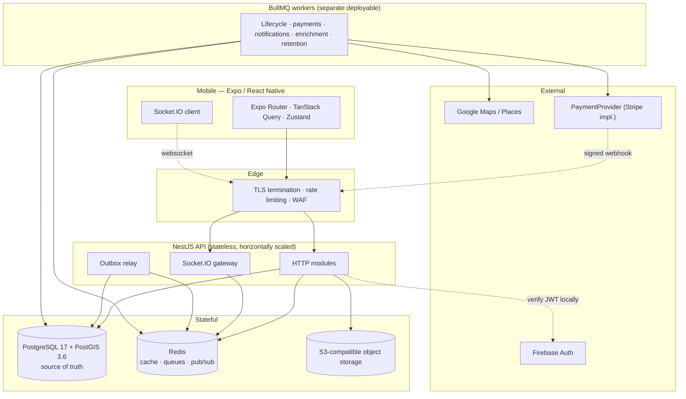
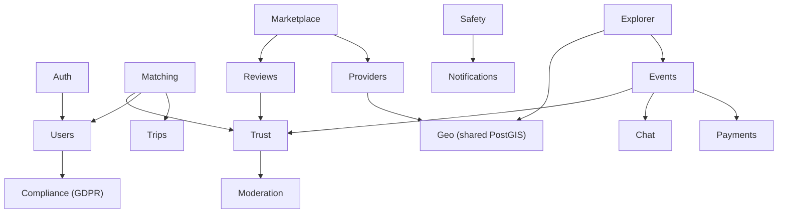

# TripWith — Phase 1: Architecture and Database

**Date:** 2026-08-20 (revised after Phase 1 correction pass)
**Status:** Implemented and verified against PostgreSQL 17.11 / PostGIS 3.6.4
**Scope:** Architecture, complete relational model, initial migration. No controllers, no frontend, no payment-provider implementation.

---

## 1. Decisions and assumptions

| Decision | Choice | Consequence |
|---|---|---|
| Data layer | TypeORM + hand-written SQL migrations | Migrations are reviewable `.sql`; no generator mangles GIST/partial/generated constructs |
| Regulatory baseline | EU-first (GDPR + PSD2/SCA, EUR) | `user_consents` ledger; payments model an SCA challenge state; money is integer minor units + ISO-4217 |
| Minimum age | 18+ platform-wide | Trigger-enforced; age-preference columns carry a hard floor of 18 |
| Repo layout | pnpm + Turborepo monorepo | `packages/shared` owns enums and date semantics used by API and mobile |

### Assumptions that materially affect architecture

Flagged per §34, because these are business decisions this document must not make silently.

1. **The €15 deposit is a platform fee retained by TripWith, not funds held on behalf of the provider.** The schema says `authorization` / `deposit` / `capture` and never *escrow*. If the model is custodial, Phase 10 changes materially (segregated balances, payout ledger, probably licensing). **Highest-consequence open item.**
2. **Remaining provider payment happens off-platform.** No payout or settlement tables. Additive later.
3. **Google Places caching windows are configuration, not schema.** The permitted window is a policy value to confirm against current Places terms at implementation time; `cache_expires_at` is per-row so a policy change is a config change.
4. **Identity verification is a placeholder** for an unchosen provider; trust weighting for verified accounts is Phase 8.

---

## 2. High-level system architecture



The API is stateless; Socket.IO rooms are shared through the Redis adapter rather than instance memory. Workers are a **separate deployable** so a burst of enrichment cannot contend with the request path. PostgreSQL is the sole source of truth.

**On Redis durability — corrected.** An earlier draft of this document claimed Redis holds "only what can be lost without correctness impact." That was wrong: Redis also holds BullMQ jobs, including `payment.capture`. The accurate statement is:

> Redis holds two categories: **disposable** state (caches, presence, rate-limit counters, pub/sub), and **in-flight job state** which is *recoverable but not disposable*. Every queued business action is reconstructible from `job_outbox` in PostgreSQL. Total Redis loss costs redelivery latency and duplicated at-least-once execution, never a lost committed action.

§6 specifies exactly how that recovery works.

---

## 3. Backend module architecture



Platform modules underneath: `Config`, `Database`, `Geo`, `Queue` (BullMQ + outbox relay), `Realtime` (Socket.IO), `Observability`.

Two additions to the §4.1 list: **`GeoModule`** (shared PostGIS builders, so spatial SQL is not copy-pasted across Explorer/Matching/Marketplace) and **`ComplianceModule`** (GDPR consent, export, erasure, retention — pulled forward by the EU-first decision).

Business logic lives in services; controllers validate and delegate; repositories own SQL.

---

## 4. Core data flows

### 4.1 Paid event join — corrected ordering

The earlier draft called `authorize()` *before* opening the database transaction, which leaves a window where money is authorized but no PostgreSQL row describes it. The corrected rule is **intent-first**:

> A committed PostgreSQL row describing the intent always exists before the provider is called, and no transaction is ever held open across a network call.

```mermaid
sequenceDiagram
    participant U as Traveller
    participant API
    participant PG as PostgreSQL
    participant PP as PaymentProvider

    U->>API: POST /events/:id/join-requests
    API->>PG: BEGIN (txn 1)
    API->>PG: INSERT payments (INITIATED, deterministic idempotency_key)
    API->>PG: INSERT event_join_requests (PENDING, expires_at, payment_id)
    API->>PG: INSERT job_outbox ('joinRequest.expire')
    API->>PG: COMMIT
    Note over API,PP: no transaction open across the network call
    API->>PP: authorize(amount, idempotency_key)
    PP-->>API: authorization + expiry
    API->>PG: BEGIN (txn 2); UPDATE payments -> AUTHORIZED; COMMIT

    Note over API,PG: host approves
    API->>PG: BEGIN (txn 3); SELECT event FOR UPDATE
    API->>PG: UPDATE join_request -> APPROVED
    Note right of PG: trigger refuses approval unless<br/>payment is AUTHORIZED or CAPTURED
    API->>PG: INSERT event_participants (trigger increments; CHECK guards capacity)
    API->>PG: INSERT job_outbox ('payment.capture:<id>')
    API->>PG: COMMIT
```

### 4.2 Failure matrix

Every transition, and what makes it recoverable.

| Failure | State left behind | Detected by | Compensation |
|---|---|---|---|
| Crash after txn 1, before `authorize()` | `INITIATED` payment, `PENDING` request | `payments_unconfirmed_intent_idx` | `getPaymentStatus(idempotency_key)` → not found → mark `CANCELLED`, expire the request |
| `authorize()` succeeds, crash before txn 2 | `INITIATED` payment, **provider holds an authorization** | same index | `getPaymentStatus` → found → adopt: set `AUTHORIZED` + `authorization_expires_at`. **This is why the intent row must precede the call — otherwise the authorization is orphaned with nothing to reconcile from** |
| `authorize()` declines | `INITIATED` → `FAILED` | direct | request expires; no seat consumed |
| Host approves, crash before commit | txn 3 rolls back atomically | — | nothing to repair; approval simply did not happen |
| Approval commits, capture job never published | `APPROVED`, seat held, outbox row unpublished | `job_outbox_undelivered_idx` | relay publishes on next pass |
| Capture published, Redis loses it | outbox row published, **not acknowledged** | same index (lease lapsed) | re-published with the same `dedupe_key` |
| Capture in flight, worker crashes | `capture_requested_at` set, status still `AUTHORIZED` | `payments_unconfirmed_capture_idx` | `getPaymentStatus` → adopt `CAPTURED` or retry; provider idempotency key makes retry safe |
| Capture **permanently** fails | `APPROVED` request, seat held, funds not taken | outbox `failed_at` (operator queue) | compensate: cancel the participant (trigger frees the seat), set payment `FAILED`, notify both parties |
| Duplicate webhook | — | `UNIQUE (provider, provider_event_id)` | insert-first `ON CONFLICT DO NOTHING`; zero rows ⇒ already processed |
| Approval attempted with unauthorized payment | rejected outright | `tw_guard_join_approval` trigger | seat is never consumed in the first place |

The last row is a schema change made during this pass: a database trigger now refuses to move a join request to `APPROVED` for an event with `deposit_minor > 0` unless the linked payment is `AUTHORIZED` or `CAPTURED`. It spans three tables so a CHECK cannot express it, and it belongs in the database because "seat granted without secured funds" only manifests under partial failure — precisely when service code is least trustworthy.

**Why no `PAYMENT_PENDING` reservation state was added.** It was considered and rejected as redundant. `payments.status = 'INITIATED'` already means "intent recorded, provider outcome unknown", and the approval trigger already prevents a seat being consumed before funds are secured. Adding a parallel reservation state would create a second source of truth for the same fact. The one genuinely missing distinction — *"capture asked for, outcome unknown"* versus *"authorized, host has not decided"* — is now carried by the single nullable column `capture_requested_at`.

### 4.3 Mutual match

Swipe writes to `swipes`. On a reciprocal `LIKE`, one transaction creates the `chat_rooms` row, both `chat_members` rows, and the `matches` row with canonically ordered IDs. `CHECK (user_a_id < user_b_id)` + `UNIQUE (user_a_id, user_b_id)` make a duplicate impossible even under simultaneous swipes; the loser takes a unique violation and reads the winner's row.

---

## 5. External service boundaries

| Service | Boundary | Rule |
|---|---|---|
| Firebase Auth | `AuthModule` verifies the ID token in-process | See below |
| Google Places | `ProvidersModule` via an enrichment worker | Lands in `provider_external_sources`, never in `providers` columns |
| PaymentProvider | `authorize / capture / cancelAuthorization / refund / getPaymentStatus / handleWebhook` | Domain code sees TripWith's `payment_status`, never a provider object |
| S3 | Pre-signed upload URLs | The API never proxies file bytes |

**Firebase verification — corrected.** An earlier draft implied a network round-trip to Firebase per request. It is not. A Firebase ID token is an RS256-signed JWT. The Admin SDK fetches Google's public signing certificates from a well-known endpoint and caches them for the lifetime the response's `Cache-Control` allows (keys rotate on the order of a day), so the steady-state path is **local signature verification plus issuer/audience/expiry claim checks — no per-request network call**. Network I/O occurs only on cache refresh, or when explicitly checking revocation (`checkRevoked`), which is reserved for sensitive operations rather than every request.

What does not change: the token is verified **server-side on every request**, and a client-supplied user ID is never trusted. The verified UID maps to `users.firebase_uid`; everything downstream uses the internal UUID.

---

## 6. Redis, BullMQ, and delivery semantics

### 6.1 The delivery model

```
PostgreSQL job_outbox  →  at-least-once relay  →  BullMQ  →  idempotent consumer
        ↑                                                            │
        └──────────────── consumer acknowledges (completed_at) ──────┘
```

The acknowledgement closing that loop is the whole design. `published_at` records only that a row was handed to Redis; it is **not** evidence the work happened. A row is retired only when `completed_at` is set (consumer succeeded, written in the consumer's own transaction) or `failed_at` is set (permanently dead, surfaced to operators). Everything else is re-drivable.

### 6.2 Required Redis configuration

BullMQ's durability is Redis's durability, so it must be configured for it:

**Production requires two separate Redis instances.** This is not a preference:

| Instance | `maxmemory-policy` | Persistence | Why |
|---|---|---|---|
| **Queue** (BullMQ + outbox delivery) | `noeviction` | AOF, `appendfsync everysec` | Evicting a BullMQ key corrupts queue structures and can lose a committed business action. RDB-only snapshots can lose minutes of queue state |
| **Cache** (feeds, viewports, rate limits, pub/sub) | `allkeys-lru` | none needed | Evicting under memory pressure is the entire point; a cache miss is harmless |

**Separate logical databases on one instance do NOT satisfy this.** `maxmemory-policy` is a *server-level* setting; `SELECT 0` and `SELECT 1` share it. One instance forces one policy on both, and both outcomes are unacceptable: `noeviction` makes the cache return OOM errors instead of evicting, while `allkeys-lru` lets Redis silently delete queue keys. An earlier draft of this document offered logical DBs as a "minimum separation" — that was wrong and is withdrawn.

Development may run a simplified single-instance setup, but only if documented as such. `infra/docker-compose.yml` deliberately runs the two-instance topology locally so development matches production; `apps/api` takes two independent connection URLs (`REDIS_QUEUE_URL`, `REDIS_CACHE_URL`) and never assumes they point at the same server.

Also: replication with automatic failover for availability. Redis replication is asynchronous, so failover can still lose recent writes — which is precisely why the outbox, not Redis, is the record of intent.

**Even with all of this, Redis durability is treated as best-effort.** Correctness does not depend on it.

### 6.3 Relay retry semantics

The relay polls `job_outbox_undelivered_idx`:

```sql
WHERE completed_at IS NULL AND failed_at IS NULL
  AND available_at <= now()
  AND (published_at IS NULL OR published_at < now() - <lease>)
ORDER BY available_at
FOR UPDATE SKIP LOCKED
```

`FOR UPDATE SKIP LOCKED` lets multiple relay instances run concurrently without coordination. Publishing uses `dedupe_key` verbatim as the **BullMQ jobId**, so a re-publish collapses onto the existing job rather than duplicating it. Publish failures increment `publish_attempts` and retry with exponential backoff; the row is never dropped.

### 6.4 Recovery after Redis loses queued work

Because a published row is not retired until its consumer acknowledges, a total Redis flush leaves every unacknowledged row still sitting in PostgreSQL with `published_at` set and `completed_at` NULL. Once the lease interval lapses, the relay's query matches them again and re-publishes. Nothing is lost; the cost is redelivery, absorbed by idempotent consumers.

This is asserted by test: after simulating publish-then-Redis-loss, exactly the unacknowledged `payment.capture` row is re-drivable, while an acknowledged row and a dead-lettered row correctly are not.

### 6.5 Reconciling critical jobs under uncertain delivery

For `payment.capture` the queue is never the authority. Two PostgreSQL-driven reconcilers close the loop independently of Redis:

- `payments_unconfirmed_intent_idx` — `INITIATED` rows older than the threshold; resolved by `getPaymentStatus(idempotency_key)`.
- `payments_unconfirmed_capture_idx` — `capture_requested_at` set but status still `AUTHORIZED`/`REQUIRES_ACTION`; resolved the same way.

So even if the queue lost a capture job *and* the outbox relay were down, a periodic reconciler would still converge payment state from the provider.

### 6.6 Idempotency and deterministic keys

| Queue | Deterministic key | Consumer idempotency |
|---|---|---|
| `payment.capture` | `payment.capture:<payment_id>` | `payments.idempotency_key` sent to provider; provider dedupes |
| `payment.cancel` | `payment.cancel:<payment_id>` | same |
| `joinRequest.expire` | `joinRequest.expire:<request_id>` | status transition guarded — only `PENDING` expires |
| `event.lifecycle` | `event.lifecycle:<event_id>:<target_status>` | FSM trigger rejects illegal/repeat transitions |
| `review.window.close` | `review.window.close:<event_id>` | idempotent state check |
| `provider.refresh` | `provider.refresh:<source>:<external_id>` | upsert |
| `trust.apply` | domain-derived | `trust_score_events.idempotency_key` UNIQUE |

Every consumer is idempotent, so at-least-once delivery is safe. No delayed business operation uses `setTimeout` or a long-running request.

### 6.7 Stale and dead rows

A sweeper re-drives unacknowledged rows past their lease. Rows exceeding `max_attempts` get `failed_at` and appear in `job_outbox_dead_idx` — an operator queue. Dead jobs are never silently discarded, because a dead `payment.capture` means a seat is held against uncaptured funds and needs the compensation in §4.2.

### 6.8 What Redis caches

Matching feed pages, Explorer viewport results, provider summaries, rate-limit counters, Socket.IO pub/sub, presence. **No authorization state is cached** — a block or restriction must take effect on the next request. §9.3 explains how that holds even for cached feeds.

---

## 7. Real-time architecture

Socket.IO with the Redis adapter. Rooms are `user:{id}` and `chat:{roomId}`. Connections authenticate with the same local JWT verification as HTTP; membership in a `chat:` room is authorised against `chat_members` on join, never inferred from the room name.

A message is persisted first, then broadcast. A dropped socket costs a redelivery, never a lost message: the client reconciles on reconnect by requesting everything after its last known `seq`. That is why `messages.seq` is gapless and monotonic per room — it makes "what did I miss?" an exact query rather than a timestamp heuristic.

---

## 8. Security and privacy boundaries

- Authorization is server-side without exception; UI affordances are not a security control.
- Ownership verified on every mutation.
- Webhooks verify signatures before any state change; `signature_verified` is recorded.
- Secrets from environment only — `data-source.ts` throws on a missing variable rather than defaulting.
- SOS tokens stored as SHA-256 digests, never plaintext.

### The live-location invariant

> Live GPS coordinates exist in exactly one table — `sos_location_updates` — and no discovery query references it.

Three structural mechanisms, all asserted by tests:

1. `users`, `user_profiles`, `user_settings` have **no geography column**. There is nowhere to write a live fix on a person.
2. `sos_location_updates` has **no spatial index**, so proximity search over it cannot be efficient — accidental use is loud.
3. The schema-wide geography column census is asserted at exactly six, by name. A seventh fails the suite.

Sensitivity tiers: public event meeting points are discoverable; trip destinations are visibility-controlled **area centroids, never device fixes**; live location is SOS-only, token-gated, time-boxed, revocable, access-logged.

---

## 9. Matching engine

`M = 0.40·I + 0.30·T + 0.20·S + 0.10·P`, each component in `[0,1]`, so `M ∈ [0,1]`.

- **`T`** = `trust_score / 10` — trust *quality*, not similarity: two users at 2.0 are not compatible merely because they match.
- **`S`** = `1 − |style_a − style_b| / 4` over the 1–5 scale.
- **`P`** = Jaccard `|A∩B| / |A∪B|` over interest IDs, via `intarray` on the denormalised array.
- **`I`** = itinerary compatibility, defined formally below.

### 9.1 Formal definition of `I`

Viewer `V` has segments `A = {a₁…a_m}`; candidate `C` has `B = {b₁…b_n}`. For segments `a`, `b`, with `R` the anchor radius:

| Term | Definition | Range |
|---|---|---|
| `len(x)` | `end(x) − start(x) + 1` (inclusive days, §10) | `≥ 1` |
| `o(a,b)` | `max(0, min(end_a,end_b) − max(start_a,start_b) + 1)` | `[0, min(len)]` |
| `τ(a,b)` | `o(a,b) / min(len(a), len(b))` | `[0,1]` |
| `d(a,b)` | geodesic distance, metres | `≥ 0` |
| `γ(a,b)` | `max(0, 1 − d(a,b)/R)` | `[0,1]` |
| `δ(a,b)` | `1` if identical non-null `destination_place_id`, else `0` | `{0,1}` |

**Co-presence gate.** `𝔸(a,b) ≡ (d(a,b) ≤ R) ∧ (o(a,b) > 0)`

**Pair score.** With weights `w_δ + w_τ + w_γ = 1`, all `≥ 0`:

```
p(a,b) = 𝟙[𝔸(a,b)] · ( w_δ·δ(a,b) + w_τ·τ(a,b) + w_γ·γ(a,b) )
```

The indicator is not a shortcut; it is the product semantics. Two travellers both away in June, one in Peru and one in Vietnam, are not itinerary-compatible. `p(a,b) ∈ [0,1]`, and **`p(a,b) = 0` whenever the gate fails** — the property the proof turns on.

**Aggregation over multiple segments.** With `β ∈ [0,1]`:

```
p*     = max over a∈A, b∈B of p(a,b)          (0 if A or B is empty)
breadth = (1/|A|) · Σ_{a∈A} max_{b∈B} p(a,b)
I      = (1−β)·p* + β·breadth
```

`p*` rewards the single strongest co-presence; `breadth` rewards a candidate who overlaps *many* of the viewer's stops. Both lie in `[0,1]`, so `I ∈ [0,1]` as a convex combination.

### 9.2 Proof that `M_ub ≥ M`

**Lemma 1 — `breadth ≤ p*`.**
For each `a ∈ A`, `max_{b∈B} p(a,b) ≤ max_{a'∈A, b∈B} p(a',b) = p*`. Summing `|A|` such terms and dividing by `|A|` gives `breadth ≤ p*`. ∎

**Theorem 1 — `I ≤ p*`.**
`I = (1−β)p* + β·breadth ≤ (1−β)p* + β·p* = p*`, using Lemma 1 and `β ≥ 0`. ∎

**Lemma 2 — SQL completeness.** Let `p̂*` be the maximum of `p(a,b)` taken over only those pairs surfaced by the anchor predicate `𝔸` (the GIST index scan). Then `p̂* = p*`.
Any pair not surfaced fails `𝔸`, so `p(a,b) = 0` by definition. Since `p ≥ 0` everywhere, discarding zero-valued elements cannot change a maximum; if every pair is zero, both quantities are `0` under the empty-max convention. ∎

**Definition.** `I_ub := p̂*`, one `MAX` aggregate over the anchored join.

**Theorem 2 — admissibility.** `I_ub ≥ I`, immediately from Lemma 2 and Theorem 1. ∎

**Theorem 3 — `M_ub ≥ M`.** Since `T`, `S`, `P` are computed **exactly** in SQL:

```
M_ub − M = 0.40·(I_ub − I) = 0.40·β·(p* − breadth) ≥ 0
```

by Lemma 1. Therefore `M_ub ≥ M` for every candidate. ∎

Two consequences worth naming. The slack is exactly `0.40·β·(p* − breadth)`, so **`β` alone controls how loose the bound is** — at `β = 0` the coarse order *is* the exact order and every request is trivially provably exact. And `I_ub` is not merely an over-estimate but the exact value of the `p*` term, which is why one cheap SQL aggregate suffices.

**Scope caveat, stated plainly.** Candidates with no anchored pair have `I = 0` and are removed at Stage 1. Such a candidate could still reach `M = 0.60` on `T`, `S`, `P` alone. The guarantee below is therefore **top-K among itinerary-eligible candidates**, where eligibility is a hard product rule (§7: "users outside travel overlap requirements" are eliminated *before* ranking), not a scoring artifact.

### 9.3 Pipeline and the exactness condition

**Stage 0 — hard elimination.** Indexed predicates only: inactive/deleted, self, already-swiped (anti-join), blocked either direction, Ghost Mode, mutual age-preference violation, trust floor, active matching restrictions.

**Stage 1 — anchor.** At least one segment pair satisfying `𝔸`, served by the composite GIST in one scan.

**Stage 2 — coarse rank.** Compute `M_ub` in SQL; order by `M_ub DESC, user_id ASC` (the tie-break makes the order total, so cursor pagination cannot skip or repeat); take `N + 1`.

**Stage 3 — exact scoring** of the first `N` in TypeScript, where the four scoring functions are pure and unit-testable.

**Exactness condition.** Sort the `N` scored candidates by exact score, `M₍₁₎ ≥ … ≥ M₍N₎`, and return the top `K` (`K ≤ N`). Let `U = M_ub` of the `(N+1)`-th row in coarse order. Because coarse order is descending, every unscored candidate `c` satisfies `M(c) ≤ M_ub(c) ≤ U`. Therefore:

```
U ≤ M₍K₎   ⟹   the returned top-K is exactly the true top-K
```

The cutoff is `M₍K₎`, **the score at the actual returned boundary** — not `M₍N₎`, the minimum over all scored candidates. Using `M₍N₎` would be needlessly conservative: candidates ranked between `K+1` and `N` are not returned, so nothing outside needs to beat them. Since `M₍K₎ ≥ M₍N₎`, the `K`-based condition is strictly easier to satisfy and still sound.

When `U > M₍K₎`, exactness is *unproven* for that request — not necessarily violated. The service emits `matching.recall_unproven`; the failure mode is observable rather than invisible. For page `j` of a cursor walk the same test applies at that page's own cutoff.

`N` is a tuning parameter, not a constant. **Calibration is deliberately deferred to Phase 4**, where sweeping `N` against p50/p95 latency and the `recall_unproven` rate produces the recall/performance curve.

### 9.4 Feed cache: ranking is cached, authorization is not

Cross-user invalidation is not attempted — one user editing a trip would fan out to every possible viewer, unbounded. Instead the cache is split by *what kind of fact* it holds.

**Cached (ranking):** the ordered candidate ID list and scores. Key `feed:v{gen}:{viewerId}:{filterHash}`, **TTL 90 s**. Viewer-side changes invalidate immediately via `INCR feed:gen:{viewerId}` — O(1), no `SCAN` — on swipe, block, filter change, Ghost Mode toggle, trip create/update/delete, and interest/style edits.

**Never cached (authorization).** Before any cached page is returned, its candidate IDs are revalidated against PostgreSQL with one indexed query over at most `K` ids:

```sql
SELECT u.id FROM users u
JOIN user_settings s ON s.user_id = u.id
WHERE u.id = ANY($ids)
  AND u.account_status = 'ACTIVE' AND u.deleted_at IS NULL
  AND NOT s.ghost_mode_enabled
  AND NOT EXISTS (SELECT 1 FROM user_blocks b
                   WHERE (b.blocker_user_id = $viewer AND b.blocked_user_id = u.id)
                      OR (b.blocker_user_id = u.id AND b.blocked_user_id = $viewer))
  AND NOT EXISTS (SELECT 1 FROM account_restrictions ar
                   WHERE ar.user_id = u.id AND ar.lifted_at IS NULL
                     AND (ar.ends_at IS NULL OR ar.ends_at > now())
                     AND ar.type IN ('MATCHING_SUSPENDED','FULL_SUSPENSION'));
```

Every predicate is index-backed (`users_discoverable_idx`, both `user_blocks` directions, `account_restrictions_active_uk`). A page shrinks rather than serving a stale entry; if it shrinks below the page size the next page is pulled forward.

**The staleness contract, precisely:**

| Fact | Staleness |
|---|---|
| Ranking order, scores, profile display data | up to 90 s |
| Another user's new/edited trip appearing | up to 90 s |
| **Block in either direction** | **0 — never served** |
| **Account restriction (matching/full suspension)** | **0** |
| **Deactivation or deletion** | **0** |
| **Ghost Mode / discovery visibility** | **0** |
| Viewer's own swipes, filters, trips | 0 (generation bump) |

Verified by test: of six candidates (clean, blocked-by-viewer, blocking-viewer, ghosted, deactivated, restricted), revalidation returns exactly the clean one.

---

## 10. Canonical date semantics

**The rule: trip dates are inclusive of both endpoints.**

> `start_date = 2026-08-20`, `end_date = 2026-08-20` **is a one-day stay.**

PostgreSQL stores `daterange(start, end, '[]')`, normalised to the half-open `[start, end+1)`. The TypeScript mirror in `packages/shared/src/dates.ts` is defined to match exactly:

| Quantity | PostgreSQL | TypeScript |
|---|---|---|
| Stay length | `upper(r) − lower(r)` | `end − start + 1` |
| Overlap days | `upper(a*b) − lower(a*b)`, 0 if empty | `max(0, min(ends) − max(starts) + 1)` |
| Overlaps? | `a && b` | `overlapDays > 0` |
| Normalised | `overlap / LEAST(len_a, len_b)` | same |

**Deliberate deviation from the product spec.** §7 gives `overlap = max(0, min(Aend,Bend) − max(Astart,Bstart))` — half-open arithmetic. Applied to inclusive dates it is off by one and reports a same-day meeting as *zero* overlap. The `+ 1` is required for the two representations to agree; the spec formula is superseded.

Resolved boundary cases, all tested on both sides:

| Case | Result |
|---|---|
| `08-20 … 08-20` | 1-day stay |
| `09-01…09-07` vs `09-07…09-12` (touching) | 1 day overlap |
| `09-01…09-07` vs `09-08…09-12` (adjacent) | 0, no overlap |
| Identical same-day stays | 1 day overlap |
| Long trip containing a 2-day stay | `τ = 1.0` (normalised by the **shorter** stay) |
| `2028-02-01…2028-02-29` (leap) | 29 days |

Normalising by the shorter stay is intentional: a traveller passing through for two days during someone's two-month trip should score fully for those two days, not be penalised for the other person's longer itinerary.

Cross-validated: `packages/shared/src/dates.test.ts` runs 7 of its cases against a live PostgreSQL instance and asserts TypeScript and SQL return identical values.

---

## 11. Database model

35 application tables. Canonical DDL: [`1787184000000-InitialSchema.up.sql`](../../../apps/api/src/database/migrations/sql/1787184000000-InitialSchema.up.sql).

Conventions: UUID PKs (`BIGINT` identity only for append-only high-volume logs); `timestamptz` throughout; money as integer minor units + ISO-4217; `GEOGRAPHY(POINT,4326)` for anything in metres; soft deletion only where a dependent record must survive.

### 11.1 Identity

**`users`** — the account.
*Columns:* `firebase_uid` (sole auth link, written only from a verified token), `email`, `account_status`, `date_of_birth`, `trust_score_raw` (unclamped running sum), `trust_score` (generated `STORED` clamp to `[0,10]`), `deleted_at`.
*Relationships:* 1:1 `user_profiles`, `user_settings`; 1:N almost everything.
*Constraints:* email format; E.164 phone; DOB sanity; `UNIQUE (id, date_of_birth)` as an FK target.
*Indexes:* unique `firebase_uid`, unique `lower(email)`, unique phone (partial), `users_discoverable_idx (trust_score) WHERE ACTIVE AND NOT deleted`.
*Triggers:* `tw_enforce_minimum_age` (see §11.10), `tw_set_updated_at`.
*Soft delete justified:* messages, reviews, payments and the trust ledger reference it. GDPR erasure anonymises rather than deletes — financial retention obligations override the erasure right.

**`user_profiles`** — display and matching inputs.
*Columns:* `display_name`, `bio`, `home_country_code`, `native_language_code`, `travel_style` (1–5), `interest_ids INT[]` (trigger-maintained projection), `identity_verified_at`.
*Constraints:* name length 2–50; bio ≤ 1000; ISO country/language patterns; style 1–5.
*Indexes:* `GIN (interest_ids gin__int_ops)`, home country (partial), travel style.
*Note:* **no geography column, deliberately.**

**`user_settings`** — discovery and privacy preferences.
*Columns:* `ghost_mode_enabled`, `ghost_mode_until`, `discovery_enabled`, `trip_visibility`, `min/max_age_preference`, `min_trust_score_preference`, `max_distance_km`, locale/timezone.
*Constraints:* `min_age_preference >= 18` (a preference can never widen below the platform floor), `max <= 120`, `min <= max`, trust preference `0..10`, distance `1..20000`, ghost expiry requires ghost enabled.

**`user_consents`** — append-only GDPR ledger.
*Columns:* `consent_type`, `granted`, `policy_version`, `source_ip`, `user_agent`.
*Constraints/triggers:* `tw_forbid_mutation` — withdrawal is a new row, never an UPDATE, because proving *when* consent existed is the point.
*Indexes:* `(user_id, consent_type, created_at DESC)` — current state is the latest row.

### 11.2 Interests

**`interests`** — lookup. `id INT` identity, `code` unique (`^[a-z0-9_]{2,40}$`), `label`, `grouping`, `is_active`, `sort_order`. A table rather than an ENUM because it is editorially managed and carries display metadata.

**`user_interests`** — join, PK `(user_id, interest_id)`, both FKs cascade. Source of truth for `user_profiles.interest_ids`. Trigger `tw_sync_interest_ids` maintains the projection. Index on `interest_id` for reverse lookup.

### 11.3 Trips

**`trips`** — `user_id`, `title`, `start_date`, `end_date`, `visibility`, `metadata JSONB` (non-searchable extras only).
*Constraints:* title 1–120; `end_date >= start_date`; `UNIQUE (id, user_id)` existing solely as the composite FK target below.
*Index:* `(user_id, start_date DESC)`.

**`trip_segments`** — the searchable itinerary unit.
*Columns:* `destination_place_id` (Google Place ID — an opaque identifier, not cached content), `destination_name`, `country_code`, `location` (destination centroid, **never a device fix**), `start_date`/`end_date`, `date_range` (generated `daterange(..,..,'[]')`), `sort_order`, `metadata`.
*Relationships:* composite FK `(trip_id, user_id) → trips(id, user_id)` — the database guarantees the denormalised `user_id` matches its trip; no trigger, no application discipline.
*Indexes:* `GIST (location, date_range)` (see §12), `(trip_id, sort_order)`, `(user_id)`, place ID (partial).

### 11.4 Providers

**`provider_category_types`** — lookup: `code`, `label`, `icon`, `is_active`, `sort_order`. Seeded with 10 rows.

**`providers`** — TripWith-owned data only.
*Columns:* `owner_user_id` (NULL for unclaimed imports), `slug`, `name`, `description`, `location`, address/city/country, `website_url`, contact fields, `price_min_minor`/`price_max_minor`/`currency`, `rating_avg`/`rating_count` (native projection, §11.7), `verified_at`, `confirmed_by_owner_at`, `published_at`, `is_active`, `deleted_at`.
*Constraints:* slug pattern; name 2–160; ISO currency/country; price ordering and non-negativity; rating `0..5`; **`published_at IS NULL OR confirmed_by_owner_at IS NOT NULL`** — §11's "never silently publish" made structurally impossible.
*Indexes:* unique slug (partial on not-deleted); owner; `providers_discoverable_gix GIST (location) WHERE published AND active AND NOT deleted`; `rating_avg DESC NULLS LAST` (same partial predicate) for Marketplace ranking.

**`provider_external_sources`** — the provenance boundary.
*Columns:* `source`, `external_id` (Place ID), `external_url`, `attribution_text`, and a **fixed allowlist** of cached fields: `cached_display_name`, `cached_formatted_address`, `cached_location`, `cached_opening_hours`, plus `cached_at`, `cache_expires_at`, `last_refresh_attempt_at`, `refresh_failure_count`.
*Constraints:* `UNIQUE (source, external_id)`; `UNIQUE (provider_id, source)`; expiry after caching; **`cached_at IS NULL OR cache_expires_at IS NOT NULL`** — cached content cannot exist without an expiry.
*Index:* `cache_expires_at` (partial) drives the refresh job.
*Design note:* deliberately typed columns rather than a payload dump. Adding a cached field is a policy decision, so making it a schema change forces review. Ratings, review text and photos have **no column at all** and are fetched live.

**`provider_media`** — first-party uploads only.
*Columns:* `kind`, `storage_key` (unique), dimensions, `byte_size`, `sort_order`, `uploaded_by_user_id`, `moderation_state`, `deleted_at`.
*Index:* `(provider_id, sort_order) WHERE NOT deleted`.

**`provider_categories`** — M:N join, PK `(provider_id, category_id)`, `is_primary`. Partial unique index enforces at most one primary per provider. Events carry exactly one category (direct FK), providers many — hence the asymmetry.

**`provider_subscriptions`** — `plan_code`, `status`, `price_minor`/`currency`, period bounds, `cancel_at`, `external_subscription_id`.
*Constraints:* period ordering; non-negative price; ISO currency.
*Indexes:* unique external ID (partial); **unique `(provider_id) WHERE status IN ('TRIALING','ACTIVE','PAST_DUE')`** — one live subscription per provider.

### 11.5 Events

**`event_categories`** — lookup: `code`, `label`, `icon`, `is_active`, `sort_order`. Seeded with the 10 §Explorer categories.

**`events`**
*Columns:* `host_type` + `host_user_id`/`host_provider_id`, `category_id`, `title`, `description`, `status`, `visibility`, `capacity_max`, `participant_count` (trigger-maintained), `price_minor`, `deposit_minor`, `currency`, `starts_at`/`ends_at`, `time_range` (generated `tstzrange`), `meeting_point` (public, host-chosen), `min_trust_score`, `join_approval_required`, `cancellation_policy`.
*Constraints:* host exclusivity (exactly one of user/provider); title 3–140; capacity 1–10000; `participant_count >= 0`; **`participant_count <= capacity_max`**; non-negative price; `deposit_minor <= price_minor`; ISO currency; `ends_at > starts_at`; trust gate `0..10`; status/timestamp pairing for CANCELLED and COMPLETED.
*Indexes:* `events_discoverable_geo_time_gix GIST (meeting_point, time_range) WHERE PUBLIC AND status IN ('ACTIVE','FULL')`; `(status, starts_at)`; `(category_id, starts_at)` partial; host indexes; `events_lifecycle_idx (starts_at) WHERE status IN ('ACTIVE','FULL','IN_PROGRESS')` for the transition job.
*Triggers:* `tw_event_status_seed` (creation row in history), `tw_event_status_guard` (validates + records transitions), `tw_set_updated_at`.

**`event_status_history`** — append-only audit: `from_status`, `to_status`, `actor_user_id` (NULL = system job), `reason`. Written by trigger, so an untracked transition is impossible. `tw_forbid_mutation` blocks UPDATE/DELETE. Index `(event_id, created_at DESC)`.

**`event_join_requests`**
*Columns:* `status`, `payment_id` (unique — one request per payment), `message`, `requested_at`, `expires_at`, decision timestamps, `decided_by_user_id`.
*Constraints:* `expires_at > requested_at`; message ≤ 500; status/timestamp pairing for each terminal state.
*Indexes:* **partial unique `(event_id, user_id) WHERE status IN ('PENDING','APPROVED')`** — one live request, while rejected/expired rows persist for audit and permit re-requesting; `(event_id, status)`; `(user_id, created_at DESC)`; `expires_at WHERE PENDING` for the 24h job.
*Triggers:* `tw_guard_join_approval` — refuses `APPROVED` for a paid event unless the linked payment is `AUTHORIZED`/`CAPTURED`.

**`event_participants`**
*Columns:* `join_request_id` (unique), `payment_id`, `is_host`, `joined_at`, `attendance_status`, `checked_in_at`, `cancelled_at`.
*Constraints:* **`UNIQUE (event_id, user_id)`**; cancellation/timestamp pairing.
*Indexes:* `(user_id, joined_at DESC)`; `(event_id) WHERE NOT cancelled`.
*Trigger:* `tw_sync_participant_count` — the mechanism that resolves the last-slot race (§12).

### 11.6 Payments

**`payments`** — one payment intent.
*Purpose:* TripWith's own record of money movement, independent of any provider's model.
*Columns:* `user_id`, `kind` (`EVENT_DEPOSIT` | `PROVIDER_SUBSCRIPTION`), `event_id` / `provider_subscription_id`, `provider` (string — `'stripe'` is a value, never a schema assumption), `provider_payment_intent_id`, `status` (**internal** state machine), `provider_status` (verbatim external string, stored for reconciliation and support, **never branched on** — §21), `amount_minor`, `currency`, `captured_amount_minor`, `refunded_amount_minor`, `authorization_expires_at` (persisted, never assumed — §20), `requires_action` (SCA/3DS), `capture_requested_at`, `idempotency_key`, and lifecycle timestamps.
*Relationships:* N:1 `users` (`RESTRICT` — erasure anonymises, never deletes a financial record); N:1 `events`; 1:N `payment_events`; 1:1 with a join request.
*Constraints:* amount > 0; ISO currency; `captured <= amount`; `refunded <= captured`; kind/target exclusivity; **`capture_requested_at IS NULL OR authorized_at IS NOT NULL`**; `UNIQUE (idempotency_key)`.
*Indexes:* unique `(provider, provider_payment_intent_id)` (partial); `(user_id, created_at DESC)`; `(event_id)`; `payments_expiring_auth_idx` for the authorization-expiry sweep; **`payments_unconfirmed_intent_idx (created_at) WHERE status = 'INITIATED'`** and **`payments_unconfirmed_capture_idx (capture_requested_at) WHERE capture_requested_at IS NOT NULL AND status IN ('AUTHORIZED','REQUIRES_ACTION')`** — the two reconciliation queues of §6.5.

**`payment_events`** — provider webhook audit and the idempotency gate.
*Purpose:* make webhook processing exactly-once in effect despite at-least-once delivery.
*Columns:* `payment_id` (nullable — an event may arrive before it can be mapped), `provider`, `provider_event_id`, `event_type`, `signature_verified`, `payload JSONB` (raw body, retained as dispute evidence), `received_at`, `processed_at`, `processing_error`.
*Constraints:* **`UNIQUE (provider, provider_event_id)`** — the handler inserts here first inside the same transaction as the state change; zero rows affected means already processed, so it returns 200 without repeating side effects.
*Indexes:* `(payment_id, received_at DESC)`; `(received_at) WHERE processed_at IS NULL`.

### 11.7 Social and chat

**`swipes`** — `source_user_id`, `target_user_id`, `direction`. `UNIQUE (source, target)`, `CHECK (source <> target)`. Indexes: `(source, target)` for the anti-join; `(target, source) WHERE direction='LIKE'` for the reciprocity probe.

**`matches`** — `user_a_id`, `user_b_id`, `chat_room_id` (unique), `matched_at`, `unmatched_at`. **`CHECK (user_a_id < user_b_id)`** + `UNIQUE (user_a_id, user_b_id)`: canonical ordering makes the unique constraint total, so the reversed pair is rejected too. Partial indexes per side where still matched.

**`chat_rooms`** — `type`, `event_id`/`provider_id`, `last_seq`, `last_message_at`. CHECK enforces exactly the right context column per type. Unique `event_id WHERE type='EVENT'` — one group room per event.

**`chat_members`** — PK `(room_id, user_id)`, `joined_at`, `left_at`, `last_read_seq`, `muted_until`. Membership is **rows, never JSON**. Unread = `chat_rooms.last_seq − last_read_seq`, an O(1) subtraction.

**`messages`** — `room_id`, `seq`, `sender_user_id` (NULL for SYSTEM), `type`, `body`, `media_storage_key`, `shared_location` (user-initiated point share, never read by discovery), `client_message_id`, `deleted_at` (soft — moderation retains evidence).
*Constraints:* `UNIQUE (room_id, seq)`; `seq > 0`; TEXT requires a 1–4000 char body; IMAGE requires a storage key; LOCATION requires a point; non-SYSTEM requires a sender.
*Indexes:* `(room_id, seq DESC)` for keyset pagination; unique `(room_id, sender, client_message_id)` making send-retry safe.
*Trigger:* `tw_assign_message_seq` — allocates `seq` under the room's row lock, so concurrent senders serialise and `seq` is never duplicated or skipped.

**`reviews`** — targets a user or a provider, optionally in an event context.
*Columns:* `reviewer_user_id`, `target_type`, `target_user_id`/`target_provider_id`, `event_id`, `rating` 1–5, `body`, `is_verified`, `moderation_state`, `deleted_at`.
*Constraints:* target exclusivity; **no self-review**; verified reviews require an event.
*Indexes:* three partial uniques implementing "one review per (reviewer, event, reviewee)" — necessary because the tuple contains NULLs, which a plain UNIQUE would not constrain; approved-review indexes per target; moderation queue.
*Trigger:* `tw_sync_provider_rating` — recomputes `providers.rating_avg`/`rating_count` from **APPROVED, non-deleted TripWith reviews only**, on insert, delete, rating edit, moderation change, or soft delete. This is what makes Marketplace ranking first-party: Google's rating is never an input and has no column anywhere in the schema.

### 11.8 Trust and moderation

**`trust_score_events`** — the ledger, and the only authority on trust.
*Columns:* `user_id` (subject), `source_user_id` (counterparty), `event_id`, `review_id`, `type`, `delta`, `reason`, `reverses_event_id`, `idempotency_key`.
*Constraints:* `UNIQUE (idempotency_key)`; `delta` within `±10`; no self-crediting; reversals must reference an original; unique reversal per original.
*Indexes:* `(user_id, created_at DESC)`; `(event_id)`; **`(source_user_id, user_id, created_at DESC)`** to detect reciprocal boosting rings.
*Triggers:* `tw_forbid_mutation` (append-only) and `tw_apply_trust_delta` — the **sole** writer of `users.trust_score_raw`.

**`account_restrictions`** — `type`, `reason`, `issued_by_user_id` (NULL = automated), `starts_at`, `ends_at` (NULL = indefinite), `lifted_at`, `notified_at`. Unique active restriction per `(user_id, type)`; expiry index; **un-notified index**, because §16 forbids silent shadow-banning.

**`user_blocks`** — `blocker_user_id`, `blocked_user_id`, unique pair, no self-block. Indexed **both directions**: candidate generation must exclude users I blocked *and* users who blocked me.

**`reports`** — polymorphic over user/event/provider/review/message with an exhaustive CHECK ensuring exactly one target column matches the declared type. `category`, `description`, `status`, handling fields. Moderation queue index; reporter index; target-user index.

### 11.9 Safety

**`sos_sessions`** — `token_hash BYTEA` (SHA-256; `CHECK octet_length = 32`; unique), `status`, `started_at`, `expires_at`, `revoked_at`, `last_location_at`, `note`. Unique active session per user; expiry index. The plaintext token exists only in the link handed to the user.

**`sos_location_updates`** — the only live-fix table. `BIGINT` identity PK, `session_id`, `location`, `accuracy_m`, `heading_deg`, `speed_mps`, `recorded_at`. Indexes: `(session_id, recorded_at DESC)` and `(recorded_at)` for retention sweeps. **Deliberately no spatial index** — proximity querying this table must never be efficient.

**`sos_access_log`** — `session_id`, `accessed_at`, `source_ip`, `user_agent`, `was_granted`. §24's access logging, including denied attempts.

### 11.10 Platform

**`job_outbox`** — transactional job intent and the durability backbone (§6).
*Purpose:* enqueuing to BullMQ is a Redis network call that cannot join a PostgreSQL transaction, so the *intent* is committed here alongside the business change and a relay publishes it afterwards.
*Columns:* `topic`, `payload JSONB`, `dedupe_key` (deterministic; used verbatim as the BullMQ jobId), `available_at`, `published_at` (dispatched — **not** proof of execution), `publish_attempts`, `completed_at` (consumer acknowledgement — **this** is proof), `failed_at`, `attempts`, `max_attempts`, `last_attempt_at`, `last_error`.
*Constraints:* `UNIQUE (dedupe_key)`; non-negative counters; **`completed_at IS NULL OR published_at IS NOT NULL`** (cannot acknowledge undispatched work); **`completed_at IS NULL OR failed_at IS NULL`** (not simultaneously successful and dead).
*Indexes:* **`job_outbox_undelivered_idx (available_at) WHERE completed_at IS NULL AND failed_at IS NULL`** — covers never-published *and* published-but-unacknowledged rows, which is what makes Redis loss survivable; `job_outbox_dead_idx (failed_at)` as the operator queue.

### 11.11 Cross-cutting mechanisms

**Enums vs lookup tables.** Native ENUMs (23) for closed domains application code branches on. Lookup tables for open, editorially-managed domains carrying icons and labels: `interests`, `event_categories`, `provider_category_types`.

**The age rule — precise reasoning.** An earlier draft claimed PostgreSQL "requires CHECK expressions to be IMMUTABLE." **That is false**, and was verified false on 17.11: `CHECK (dob <= CURRENT_DATE)` is accepted without complaint and enforced at write time. That is exactly why it is the wrong tool. A non-immutable CHECK is a *write-time assertion*, not a table-wide invariant — PostgreSQL re-evaluates it only when a row is written, so a table can come to hold rows the expression no longer accepts, and `pg_dump` serialises `CURRENT_DATE` verbatim so a restore re-evaluates against the restore-time clock. For "at least 18" the drift happens to be benign (the predicate only gets easier to satisfy as time passes), but relying on that coincidence is fragile: any tightening — an upper bound, a re-verification window, a jurisdiction requiring 21 — silently converts it into a restore hazard. The operative reason is simpler: this is a business policy needing a stable error code, a clear message, and one place to evolve. `tw_enforce_minimum_age` raises `check_violation` with a readable message on INSERT and on UPDATE of `date_of_birth`; a CHECK would yield a generic violation naming an internal constraint.

---

## 12. ER overview

```mermaid
erDiagram
    users ||--|| user_profiles : has
    users ||--|| user_settings : has
    users ||--o{ user_consents : records
    users ||--o{ user_interests : selects
    interests ||--o{ user_interests : chosen_by
    users ||--o{ trips : plans
    trips ||--o{ trip_segments : contains
    users ||--o{ swipes : casts
    users ||--o{ matches : participates
    matches ||--|| chat_rooms : opens
    chat_rooms ||--o{ chat_members : includes
    chat_rooms ||--o{ messages : holds
    users ||--o{ chat_members : joins
    users ||--o{ providers : owns
    providers ||--o{ provider_external_sources : sourced_from
    providers ||--o{ provider_media : shows
    providers ||--o{ provider_categories : tagged
    provider_category_types ||--o{ provider_categories : labels
    providers ||--o{ provider_subscriptions : billed_by
    users ||--o{ events : hosts
    providers ||--o{ events : hosts
    event_categories ||--o{ events : classifies
    events ||--o{ event_status_history : audited_by
    events ||--o{ event_join_requests : receives
    events ||--o{ event_participants : confirms
    users ||--o{ event_join_requests : submits
    event_join_requests ||--o| event_participants : becomes
    users ||--o{ payments : makes
    events ||--o{ payments : funded_by
    provider_subscriptions ||--o{ payments : billed_by
    payments ||--o{ payment_events : audited_by
    event_join_requests ||--o| payments : secured_by
    users ||--o{ reviews : writes
    providers ||--o{ reviews : rated_by
    events ||--o{ reviews : context_for
    users ||--o{ trust_score_events : subject_of
    reviews ||--o| trust_score_events : justifies
    users ||--o{ account_restrictions : restricted_by
    users ||--o{ user_blocks : blocks
    users ||--o{ reports : files
    users ||--o{ sos_sessions : opens
    sos_sessions ||--o{ sos_location_updates : streams
    sos_sessions ||--o{ sos_access_log : accessed_via
```



`job_outbox` has no foreign keys by design — it must survive independently of the rows that produced it.

---

## 13. Index strategy, with measurements

Measured on 150,000 trip segments and 100,000 events across 40 real travel hubs — clustered, not uniform, because uniform data flatters any spatial index. Median of 9 runs, PostgreSQL 17.11, parallelism disabled.

**Matching predicate** (`ST_DWithin` + `date_range &&`):

| Config | Time | Buffers |
|---|---|---|
| Composite `GIST(location, date_range)` | **0.276 ms** | **326** |
| Separate `GIST(location)` + `GIST(date_range)` | 0.995 ms | 426 |
| `GIST(location)` only | 0.898 ms | 2203 |

Sensitivity sweep across radius 10/50/200 km × window 7/30/90 days: the composite wins **every** cell by **1.24×–5.48×**, widening with result size.

**Explorer predicate:** partial composite **0.073 ms / 40 buffers** vs partial spatial-only 0.230 ms / 731 buffers — 3.2× faster on 18× less buffer traffic.

**Two indexes measured and deliberately dropped:** standalone `GIST(location)` on `trip_segments` (composite serves bare spatial queries at least as well — 1.318 ms vs 1.597 ms — so a second 10 MB index buys nothing), and standalone `GIST(meeting_point)` on `events` (wins only the rare no-time-filter case by ~0.09 ms, at 5.5 MB plus write churn).

**One accepted gap, recorded not hidden:** a *date-only* predicate on `trip_segments` cannot use the composite's leading column and degrades to **7.295 ms vs 1.508 ms**. No Phase 1 access path filters segments by date without a geographic anchor, so that 8.5 MB index is not created; the measurement lives in the migration comment so re-adding it is a decision with a known payoff.

Reproduce: `apps/api/src/database/scripts/{seed-benchmark-data,benchmark-indexes}.sql`.

---

## 14. Verification results

Against a live PostgreSQL 17.11 / PostGIS 3.6.4 instance, on the final migration, after a clean `up → down → up` cycle.

```
migration up/down/up   clean (only PostGIS spatial_ref_sys survives down, by design)
invariant suite        89 passed, 0 failed
concurrency race       24 joiners, capacity 5 -> exactly 5 committed, 19 rejected
                       by events_capacity_not_exceeded_chk, counter consistent
TS unit + PG parity    18 passed, 0 failed (7 cases compared against live SQL)
enum parity            23 ENUM types, 88 values, 0 drift
schema objects         35 app tables, 134 indexes, 95 CHECK, 67 FK, 28 triggers,
                       23 ENUM types, 3 GIST indexes, 11 trigger functions
```

### The trust-projection correction, proven

Per-event clamping diverges from `clamp(initial + Σdeltas)`: a user driven to −2.0 then credited +0.2 shows **0.20** under incremental clamping but must show **0.00**. `trust_score_raw` holds the unclamped sum; the public score is a generated clamp of it, exactly equal to a full ledger replay:

```
trust: raw sum unclamped, public score floors at 0    raw=-2.000 public=0.00
trust: no divergence — clamp(sum) not sum(clamp)      raw=-1.800 public=0.00
                                                      (incremental clamping would give 0.20)
trust: recovery from below zero requires real credit  raw=3.200  public=3.20
trust: public score ceilings at 10                    raw=12.200 public=10.00
trust: projection identical to full ledger replay     ✓
```

---

## 15. §36 validation

| Question | Answer | Verified by |
|---|---|---|
| Prevent duplicate matches? | Canonical `CHECK (a < b)` + `UNIQUE (a,b)` | reversed-pair test |
| Prevent duplicate participation? | `UNIQUE (event_id, user_id)` | duplicate insert test |
| Concurrent final slot? | Trigger `UPDATE` serialises on the event row; `CHECK` rejects the loser | 24-way race, exactly 5 winners |
| Trust auditable? | Append-only ledger; trigger-only projection | UPDATE/DELETE rejected |
| Payments idempotent? | `UNIQUE (provider, provider_event_id)` + insert-first | replay inserts 0 rows |
| Blocking reliable? | Directional rows, indexed both ways, anti-joined and revalidated | self-block rejected; revalidation test |
| Live locations private? | No geography on identity tables; no spatial index on SOS; census asserted at 6 | 3 structural assertions |
| Indexed radius queries? | Partial composite GIST | EXPLAIN + benchmark |
| Efficient trip/date overlap? | Generated `daterange` + composite GIST | benchmark sweep |
| Chat without JSON members? | `chat_members` rows; O(1) unread | membership + unread tests |
| Auditable transitions? | Trigger validates and records every change | illegal transitions rejected |
| Owned vs Google data? | Separate table, typed allowlist, TTL required, no restricted-content column | 3 provenance tests |
| **Queued action survives Redis loss?** | Outbox row retired only on consumer ack | re-drive test |
| **Authorization orphaned by a crash?** | Intent row committed before the provider call; two reconciliation queues | reconciliation index tests |
| **Seat given away unpaid?** | `tw_guard_join_approval` trigger | 4 approval-gate tests |
| **Privacy change delayed by cache?** | Authorization revalidated per request, never cached | 6-candidate revalidation test |
| **Do SQL and TS agree on dates?** | One canonical inclusive semantic | 7 live cross-validation cases |

---

## 16. Remaining risks

1. **Deposit legal characterisation** (assumption 1). Highest-consequence open item; must be settled before Phase 10.
2. **Trigger-heavy design.** Eleven trigger functions carry capacity, seq, trust, audit, rating and approval invariants. Deliberate — they hold regardless of caller — but invisible from application code. Every trigger has a named test; bulk-import paths must be reviewed against them (the benchmark seed already had to disable the audit guard explicitly, which is the intended friction).
3. **`interest_ids` denormalisation** is a second copy of `user_interests`. Trigger-maintained and tested, but a bulk operation bypassing row triggers would drift it. Reconciliation job needed in Phase 4.
4. **Matching `N` uncalibrated.** The proof and recall guard are complete; the numbers need Phase 4's scoring implementation.
5. **`payment_events.payload`** stores raw webhooks — justified as dispute evidence, but may contain personal data and needs a retention policy in Phase 10.
6. **Outbox relay is not yet implemented.** The schema and semantics are specified and tested; the relay process itself is Phase 2/10 work. Until it exists, nothing publishes outbox rows.
7. **Scale is uncharacterised.** No sharding or read replicas are modelled. The only measured figures are the §13 single-query latencies — 0.276 ms for the matching predicate, 0.073 ms for Explorer — taken single-connection, warm-cache, with parallelism disabled. **These are latency measurements, not throughput results.** No concurrent-load or QPS benchmark has been run, so this document makes no claim about supported user counts. Capacity planning requires a mixed read/write workload benchmark at target concurrency, which is Phase 13 work.
8. **PostGIS/PG major version is pinned** in `infra/docker-compose.yml`; benchmarks are version-specific and must be re-run on upgrade.

---

## 17. Out of scope for Phase 1

No controllers, DTOs, or NestJS modules. No frontend. No payment-provider implementation. No outbox relay process. No entity classes — the schema is the contract this phase delivers, and entities follow in Phase 2 against a proven database.

---

## 18. Files

```
apps/api/src/database/migrations/1787184000000-InitialSchema.ts            TypeORM wrapper
apps/api/src/database/migrations/sql/1787184000000-InitialSchema.up.sql    canonical schema
apps/api/src/database/migrations/sql/1787184000000-InitialSchema.down.sql  reversal
apps/api/src/database/data-source.ts                                       env-only config
apps/api/src/database/scripts/verify-invariants.sql                        89 assertions
apps/api/src/database/scripts/verify-concurrency.sh                        capacity race
apps/api/src/database/scripts/seed-benchmark-data.sql                      benchmark fixture
apps/api/src/database/scripts/benchmark-indexes.sql                        index comparison
packages/shared/src/enums.ts                                               shared vocabulary
packages/shared/src/dates.ts                                               canonical date semantics
packages/shared/src/dates.test.ts                                          unit + live SQL parity
scripts/check-enum-parity.mjs                                              drift check
infra/docker-compose.yml                                                   pinned PG/PostGIS + Redis
```

**Phase 1 ends here.** Phase 2 does not begin without explicit instruction.
